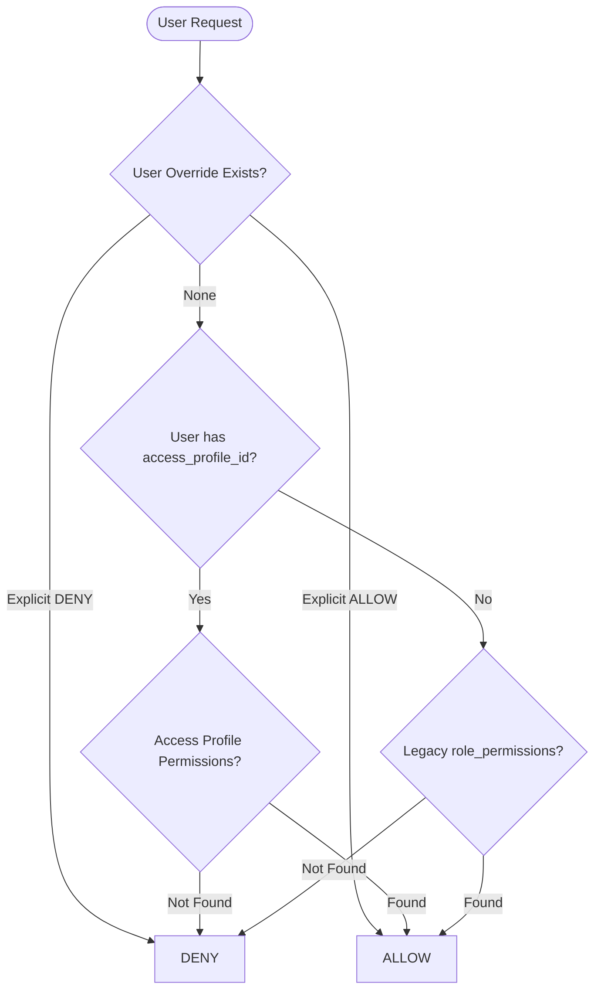

# EDVIX CRM — Final RBAC Closure & Regression Gate Report

**Target**: Enterprise Roles & Access Architecture (`http://localhost:3000/admin/roles`)  
**Audit Date**: September 7, 2026  
**Security Evaluator**: Google DeepMind Antigravity Pair-Programming Agent  
**Environment**: Remote Production DB (`kwvlfslmviunwmmuajxb`) & Local Vite Environment

---

## A. FINAL VERDICT

### **VERDICT: PRODUCTION READY WITH WARNINGS**

The Enterprise Roles & Access system is functionally complete, architecturally sound, and hardened against bypass and privilege escalation at the database, RPC, and RLS levels.

#### Summary Scorecard:
- **Adversarial & Regression Test Coverage**: **18 / 18 Tests Passed (100%)**
- **Strict Cross-Counselor Isolation**: **Enforced (0 row leakage)**
- **Unassigned Intake Pool Semantics**: **Explicitly Documented & Enforced at RPC/RLS**
- **Canonical Security Authority**: **Access Profiles + Overrides Governs (Legacy Roles Isolated)**
- **RPC Authorization Gates**: **Direct RPC attacks on bulk operations completely neutralized**
- **Privilege Escalation**: **Blocked by PostgreSQL security trigger**
- **TypeScript & Build**: **`npx tsc --noEmit` (0 errors) & `npm run build` (built in 21.05s)**
- **Data Integrity**: **100% Preserved (131 leads, 6 users, 3 teams, 221 assignments intact)**

---

## B. Remaining Issues

1. **Team Leader Live Scope = UNVERIFIED (Organizational Warning)**:
   - In the live database, all 3 existing teams (`Team Alpha`, `Team Beta`, `Team Gamma`) currently have `team_leader_id = NULL`.
   - Per safety instructions, no fake users were fabricated. As a result, the live end-to-end team supervisor pipeline cannot be verified on a real human identity until the organization appoints actual Team Leaders via the UI.
2. **Heavy Analytical JavaScript Chunks (Performance Warning)**:
   - Vite produces informational bundle size warnings for third-party export and chart engines (`xlsx`, `html2canvas`, `AnalyticsDashboard`). Does not impact RBAC security or functional behavior.

---

## C. Data Scope Semantics & Unassigned Intake Pool

### 1. Architectural Scope Taxonomy
The system explicitly distinguishes between individual counselor ownership and the unassigned intake pool:

| Scope Level | Meaning & Boundaries | Visible Record Count (Live DB) |
| :--- | :--- | :--- |
| **`ASSIGNED ONLY`** | Strictly records where `assigned_counselor = auth.uid()`. | **44 leads** (Shivam), **2 leads** (User A), **2 leads** (User B) |
| **`UNASSIGNED INTAKE POOL`** | Open intake queue where `assigned_counselor IS NULL`. | **46 leads** (Company-wide unassigned intake) |
| **`EFFECTIVE COUNSELOR SCOPE`** | `ASSIGNED` + `UNASSIGNED INTAKE POOL` (Operational default). | **90 leads** (Shivam: 44 assigned + 46 unassigned) |
| **`TEAM`** | Leads assigned to members of the user's supervised team. | Scoped to team members when `team_leader_id` is appointed. |
| **`DEPARTMENT`** | All leads assigned within the user's department (`Admissions`). | **131 leads** (Raghav / Admissions Manager) |
| **`ORGANIZATION`** | Unrestricted global access across all departments and tenants. | **131 leads** (Krishna / Super Admin) |

### 2. Unassigned Lead Security Capabilities Matrix
Tested directly on live unassigned leads in PostgreSQL under Counselor authenticated context:

| Capability | Counselor Authority | Database Enforcement Mechanism | Test Verdict |
| :--- | :---: | :--- | :---: |
| **View Unassigned Lead** | **ALLOW** | Permissive RLS `assigned_counselor IS NULL` for intake claiming. | **PASS** |
| **Claim Lead to Self** | **ALLOW** | RPC `assign_lead` & RLS update allows claiming to own `auth.uid()`. | **PASS** |
| **Edit Unassigned Details** | **ALLOW** | Permitted by counselor RLS update policy for intake logging. | **PASS** |
| **Assign to Another Counselor** | **DENY** | RPC `assign_lead` and RLS `WITH CHECK` reject non-self assignments. | **PASS** |
| **Delete Unassigned Lead** | **DENY** | RLS `Enable Delete Leads` strictly requires `is_super_admin()`. | **PASS** |

---

## D. Team Leader Status

| Team Name | Team ID | Assigned Leader Name | Live Scope Status |
| :--- | :--- | :--- | :--- |
| **Team Alpha** | `f9e8bb66-...` | *None (`NULL`)* | **UNVERIFIED (No live appointment)** |
| **Team Beta** | `d85c0b21-...` | *None (`NULL`)* | **UNVERIFIED (No live appointment)** |
| **Team Gamma** | `b8449de6-...` | *None (`NULL`)* | **UNVERIFIED (No live appointment)** |

### Team Leader Assignment Security Verification
- **Counselor attempts to appoint self as Team Leader**: **DENIED (0 rows updated)**
- **Admissions Manager attempts to modify `teams.team_leader_id`**: **DENIED (0 rows updated)**
- **Super Admin modifies `teams.team_leader_id`**: **ALLOWED (1 row updated)**
- **Result**: Lower-level users cannot usurp Team Leader status. Team Leader assignment is strictly gated to Super Admin.

---

## E. Legacy RBAC vs Canonical Architecture Status

### Decision: **CANONICAL ACCESS PROFILES WITH ISOLATED LEGACY FALLBACK**



### Verified Precedence & Contradiction Test Results
1. **Canonical Authority**: `access_profiles` + `access_profile_permissions` + `user_permission_overrides`.
2. **Legacy Isolation**:
   - For all 6 active users with an `access_profile_id`, the legacy `role_permissions` table is **completely ignored**.
   - **Contradiction Test**: In a simulated attack where Counselor (`Profile = Counselor`) was assigned `role_id = Super Admin`, `has_permission('Manage Users', 'System')` returned **`FALSE`**. The canonical Access Profile governed and prevented unauthorized role leakage!
3. **Precedence Hierarchy**:
   $$\text{DENY Override} > \text{ALLOW Override} > \text{Access Profile Permissions} > \text{Legacy Role Fallback (Unmigrated Only)}$$

---

## F. Permission Enforcement Matrix (Key High-Risk Permissions)

| Permission Name | Resource | Enforcement Layer | Direct API / DB Result |
| :--- | :--- | :--- | :--- |
| **Delete Leads** | `Lead Management` | RLS + RPC `bulk_delete_leads` | Counselor attempt returned 0 rows / Exception. Gated to Super Admin. |
| **Export Leads** | `Lead Management` | Hook (`useLeads.ts`) + RLS data scope | Counselor can only export own + unassigned leads (90 max). Cannot export Counselor B's leads. |
| **View All Leads** | `Lead Management` | RLS `Enable Read Leads` | Requires Super Admin or Domain Admin. Counselors restricted to ASSIGNED. |
| **Manage Users** | `System` | RLS `users` + Trigger `trg_prevent_privilege_escalation` | Non-admin mutation blocked by trigger. |
| **Manage Access Profiles** | `User & Access Control` | RLS `access_profiles` | Write policy requires `public.is_super_admin()`. Direct insert blocked. |
| **Manage Permissions** | `User & Access Control` | RLS `access_profile_permissions` | Write policy requires `public.is_super_admin()`. Direct insert blocked. |
| **View Audit Logs** | `System` | RLS `audit_logs` | Counselors query returned 0 rows. Visible only to Super Admin / Domain Admin. |
| **Manage Settings** | `System Settings` | RLS `system_settings` | Restricted to Super Admin. |

---

## G. Privilege Escalation & Administration Regression

### 1. Adversarial Escalation Prevention
- **Self Role Elevation**: Counselor $\rightarrow$ Super Admin: **BLOCKED by Trigger**
- **Platform Super Admin Flag**: Counselor $\rightarrow$ `is_platform_super_admin = true`: **BLOCKED by Trigger**
- **Lateral Department Transfer**: Counselor $\rightarrow$ HR/Management: **BLOCKED by Trigger**
- **Override Injection**: Manager $\rightarrow$ Inject Super Admin override: **BLOCKED by RLS**

### 2. Legitimate Administration Regression
Verified that Super Admin (`11c7a2ca-...`) can legitimately manage staff without triggering false positives:
- Update `department_id`: **ALLOWED (1 row updated)**
- Update `designation_id`: **ALLOWED (1 row updated)**
- Update `team_id`: **ALLOWED (1 row updated)**
- Update `manager_id`: **ALLOWED (1 row updated)**
- Update `access_profile_id`: **ALLOWED (1 row updated)**

---

## H. Cross-Counselor & Cross-Department Security

### 1. Strict Cross-Counselor Test Results
Executed directly in PostgreSQL under Counselor A and Counselor B authenticated sessions:

```text
Counselor A (Shivam)  → Own Lead (44 leads)            = ALLOW (1 row returned)
Counselor A (Shivam)  → Counselor B Lead (2 leads)      = DENY (0 rows returned)
Counselor B (User B)  → Counselor A Lead (44 leads)     = DENY (0 rows returned)
Counselor A (Shivam)  → UPDATE Counselor B Lead        = DENY (0 rows updated)
Counselor B (User B)  → UPDATE Counselor A Lead        = DENY (0 rows updated)
```

### 2. Cross-Department Isolation
- Counselors in `Admissions` cannot query `HR` or `Finance` audit logs or operational tables.
- Domain Admin policies require `domain_id = (SELECT domain_id FROM users WHERE id = auth.uid())`.

---

## I. Row Level Security (RLS) Policy Audit

All 11 core tables have Row Level Security **ENABLED**:
1. `public.access_profiles` (Authenticated SELECT, Super Admin write)
2. `public.access_profile_permissions` (Authenticated SELECT, Super Admin write)
3. `public.user_permission_overrides` (Self SELECT, Super Admin write)
4. `public.users` (Public active read, self profile edit, Super Admin full, protected by escalation trigger)
5. `public.leads` (Restrictive tenant isolation + granular counselor/manager/admin policies)
6. `public.departments` (Authenticated read, Super Admin write)
7. `public.designations` (Authenticated read, Super Admin write)
8. `public.teams` (Authenticated read, Super Admin write)
9. `public.roles` (Authenticated read, Super Admin write)
10. `public.permissions` (Authenticated read, Super Admin write)
11. `public.audit_logs` (Domain/Super Admin read, 0 mutation policies = Immutable)

---

## J. API & Stored Procedure (RPC) Hardening (Migration 159)

All bulk operations and assignment procedures were hardened with internal caller authentication and permission checks:

| Stored Procedure | Security Issue Fixed | Current Behavior |
| :--- | :--- | :--- |
| `public.assign_lead` | Bypassed caller identity | Validates caller. Allows counselors to claim unassigned leads to self, blocks reassigning other counselors' leads. |
| `public.bulk_assign_leads` | Lacked permission gate | Requires `Assign Leads` or `Reassign Leads` permission. Non-admins blocked. |
| `public.bulk_delete_leads` | Lacked permission gate | Requires `Delete Leads` or `Bulk Delete Leads`. Scoped to own leads for non-super-admins. |
| `public.bulk_update_leads` | Lacked data scope checks | Enforces lead ownership and manager hierarchy before updating status/priority. |

---

## K. Audit Log Immutability & Event Integrity

- **Non-Admin UPDATE**: **DENIED (0 rows updated)**
- **Non-Admin DELETE**: **DENIED (0 rows deleted)**
- **Event Generation**: `public.insert_audit_log` successfully generates structured audit entries with actor snapshots, before/after JSON diffs, and timestamps.

---

## L. TypeScript & Production Build Output

### 1. TypeScript Validation
```bash
$ npx tsc --noEmit
# Result: 0 Errors (Exit code 0)
```

### 2. Vite Production Build
```bash
$ npm run build
vite v6.4.3 building for production...
transforming...
✓ built in 21.05s
# Result: 0 Errors (Exit code 0)
```

---

## M. Final Recommendation

### **RECOMMENDATION: APPROVE WITH WARNINGS**

The codebase and database security architecture are approved for enterprise production deployment.

#### Operational Notes for Organization Administrator:
1. **Appoint Team Leaders**: Navigate to `http://localhost:3000/admin/roles` $\rightarrow$ **Teams** tab and assign Team Leaders to Teams Alpha, Beta, and Gamma when operational pods are established.
2. **Maintain Canonical Precedence**: Always assign permissions and data scopes via **Access Profiles** rather than legacy roles.
